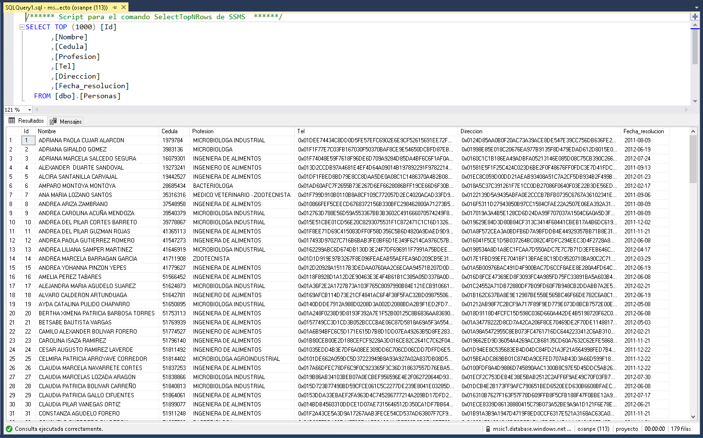

# Proyecto de Seguridad en Bases de Datos Entrega 2
Proyecto aplicacion controles framework de ciberseguridad de la NIST entrega 2

## Tabla de Contenido

* [1. Identificación de vulnerabilidades (ID.RA-1)](#1-identificación-de-vulnerabilidades-idra-1)
* [2. Ciberamenazas (ID.RA-2))](#2-ciberamenazas-idra-2)
* [3. Identificación de amenazas (ID.RA-3)](#3-identificación-de-amenazas-idra-3)
* [4. Impacto potencial (ID.RA-4)](#4-impacto-potencial-idra-4)
* [5. Identidades y credenciales (PR.AC-1)](#5-identidades-y-credenciales-prac-1)
* [6. Gestión de permisos (PR.AC-4)](#6-gestión-de-permisos-prac-4)
* [7. Protección de datos en reposo (PR.DS-1)](#7-protección-de-datos-en-reposo-prds-1)
* [8. Datos en transito (PR.DS-2)](#8-datos-en-transito-prds-2)
* [9. Ciclo de vida de activos (PR.DS-3)](#9-ciclo-de-vida-de-activos-prds-3)
* [10. Mantener la disponibilidad (PR.DS-4)](#10-mantener-la-disponibilidad-prds-4)
* [11. Linea base (PR.IP-1)](#11-linea-base-prip-1)

 - - -

## 1. Identificación de vulnerabilidades (ID.RA-1)

Muestra.

## 2. Ciberamenazas (ID.RA-2)

Muestra.

## 3. Identificación de amenazas (ID.RA-3)

Muestra.

## 4. Impacto potencial (ID.RA-4)

Muestra.

## 5. Identidades y credenciales (PR.AC-1)

El metodo de autenticación usado para los usuarios será el propio de la base de datos

## 6. Gestión de permisos (PR.AC-4)

Muestra.

## 7. Protección de datos en reposo (PR.DS-1)

La base de datos cuenta dos mecanimos establecidos para la protección de los datos en reposo los cuales son:

* ****Cifrado de datos transparente:**** El cifrado de datos transparente (TDE) se encarga de cifrar el almacenamiento de toda una base de datos mediante una clave simétrica denominada clave de cifrado de base de datos. Esta clave de cifrado de base de datos está protegida por el protector de cifrado de datos transparente. El protector es un certificado administrado por el servicio (cifrado de datos transparentes administrado por el servicio) o una clave asimétrica almacenada en Azure Key Vault (Bring Your Own Key).

* ****Always Encrypted:**** Es una tecnología de cifrado de datos de Azure SQL Database y SQL Server que ayuda a proteger los datos confidenciales en reposo en el servidor durante el traslado entre el cliente y el servidor, y mientras los datos están en uso. Always Encrypted garantiza que los datos confidenciales nunca van a aparecer como texto no cifrado dentro del sistema de base de datos.

En la siguiente imagen se presenta una muestra de los datos antes del proceso de cifrado de columnas con Always Encrypted:

En las siguientes imagenes se presenta el proceso de cifrado de columnas usando Always Encrypted:

En las siguiente imagenes se observan el cifrado exitoso de columnas:

Finalmente, es importante mencionar que las llaves de cifrado son dos "clave maestra de columna (CMK)" y "clave de cifrado de columna (CEK)", las cuales se encuentran resguardadas a través de Azure Key Vault, el cual provee el almacenamiento seguro de claves de cifrado a través del uso de módulos de seguridad de hardware (HSM). En la siguiente imagen se observan las llaves resguardadas en Azure Key Vault:

## 8. Datos en transito (PR.DS-2)

Para la protección de datos en transito se establecen dos medidas, la primera de ellas es Always Encrypted la cual es mencionada en el numeral [7. Protección de datos en reposo (PR.DS-1)](#7-protección-de-datos-en-reposo-prds-1) y la segubda es que el intercambio de información a través de VPN tal como lo establece el [flujo de datos de información](https://github.com/pepachon/Proyecto_Seguridad_BD_MSIC-1/blob/Rama_Proyecto/Flujo_datos/Readme.md#flujo-de-datos-de-informaci%C3%B3n). En la siguiente imagen se puede observar la configuración definida para VPN a través del uso de certificado:

Adicionalmente, se realizó la verificación de soporte SSL/TLS soportado por el servidor, encontrando que no se soporta SSL como se observa a continuación:

## 9. Ciclo de vida de activos (PR.DS-3)

Muestra.

## 10. Mantener la disponibilidad (PR.DS-4)

En busca de mantener la disponibilidad se realiza el monitoreo de los recursos usados por el equipo de la base de datos, en la siguiente imagen se presenta el monitoreo del promedio de consumo de recursos de la CPU de la base datos en los últimos 7 días:

A continuación se observa el monitoreo del promedio de consumo de disco de la base datos en los últimos 7 días:

Además, se presenta el promedio de iniciós de sesión en la base de datos "proyecto":

Finalmente, se presenta el consumo de CPU de la última semana producto de la ejecución consultas o la entrada y salida de registros:

## 11. Linea base (PR.IP-1)

En las siguientes imaganes se presentan las actividades de aseguramiento realizadas de acuerdo a la [guía CIS de Azure](./PRIP1/CIS_Microsoft_Azure_Foundations_Benchmark_v1.0.0.pdf):

Numeral 4.2.1

Numeral 4.2.2

Numeral 4.2.3

Numeral 4.2.4

Numeral 4.2.6

Numeral 4.2.7

Numeral 8.1

Adicionalmente, las siguientes imaganes se presentan las actividades de aseguramiento realizadas de acuerdo a la [guía CIS de SQL Server 2016](./PRIP1/CIS_Microsoft_SQL_Server_2016_Benchmark_v1.0.0.pdf):

Numeral 2.1

